# mermaid.jsメモ
## 概要
- Javascriptのチャート生成ライブラリ
- テキスト形式で、図やフローチャートを生成できる。

## 記法
### 基本
#### ノード（接続点）
- 各図形の意味は、[こちら](https://www.edrawsoft.com/jp/flowchart-symbols.php)を参考にする。

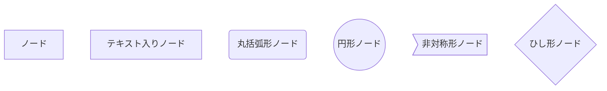

#### リンク（接続）
- 例のチャートは、下記の順番で指定。
    - 矢印付きリンク
    - オープンリンク
    - リンク上テキスト
    - 矢印とテキストのリンク
    - 点線リンク
    - 点線リンク上テキスト
    - 太線リンク
    - 太線上のテキスト
    - 特殊文字コード使用
        - 特殊文字詳細は、[こちら](http://www.shikaku-d.com/neko/character_entity.html)
        - 特殊文字変換ツールは[こちら](https://tech-unlimited.com/escape.html)

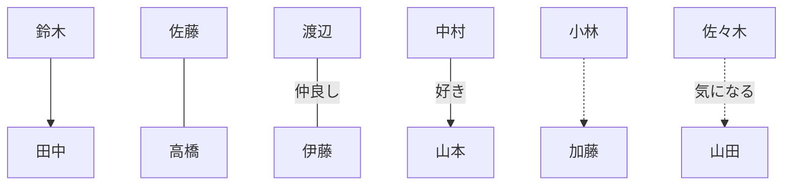

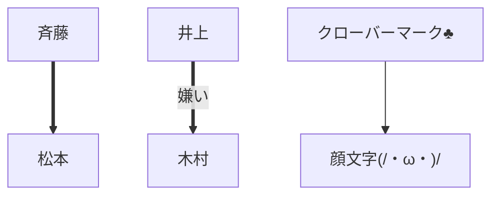

#### サブグラフ

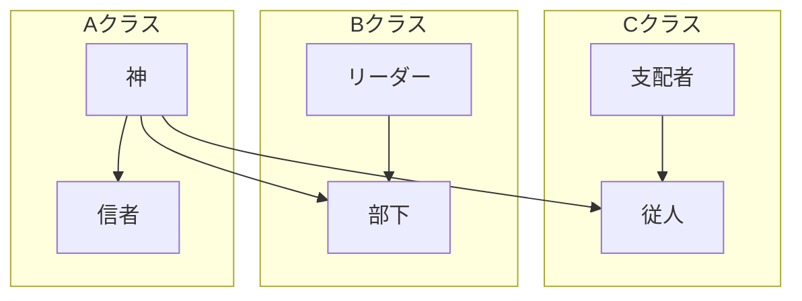

#### 動き

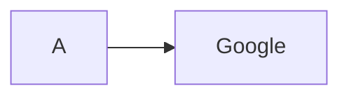

#### スタイル指定

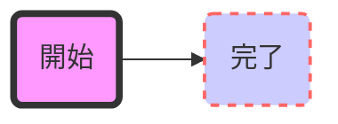

### フローチャート
- フローチャートを作成の際には、「graph タイプ」で指定
- 指定タイプは、下記。
    - TB - 上から下
    - BT - 下から上
    - RL - 右から左
    - LR - 左から右

- 下記は、上から下への流れを示すフローチャート

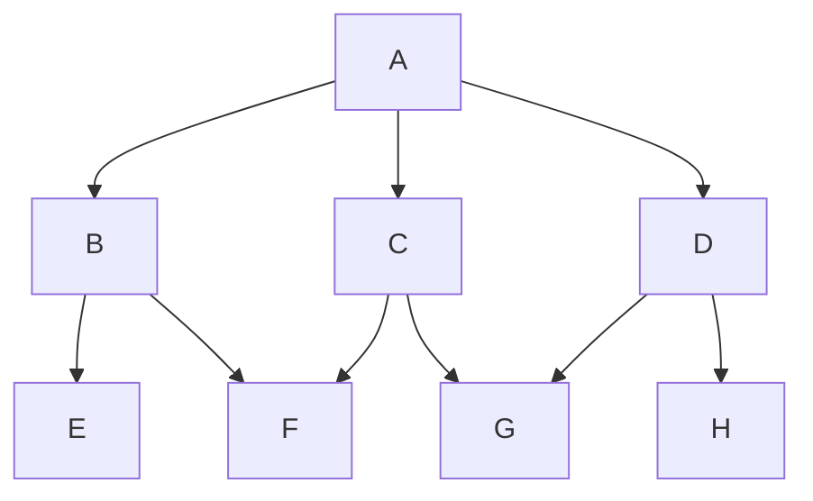

- 下記は、左から右への流れを示すフローチャート  
※同じノード（接続点）があれば、自動的に流れを示す。

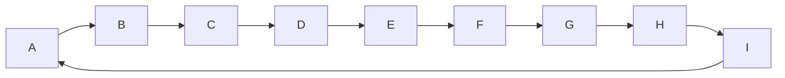

### シーケンス図
- 最初に「sequenceDiagram」を指定する。

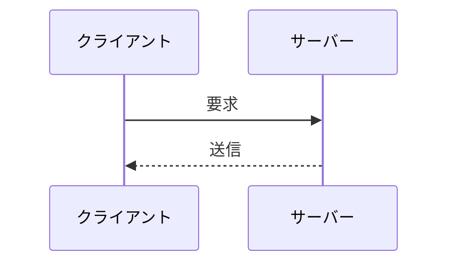

- ライフライン（参加者）を定義することもできる。
- エイリアス（変数や名前）を指定することもできる。

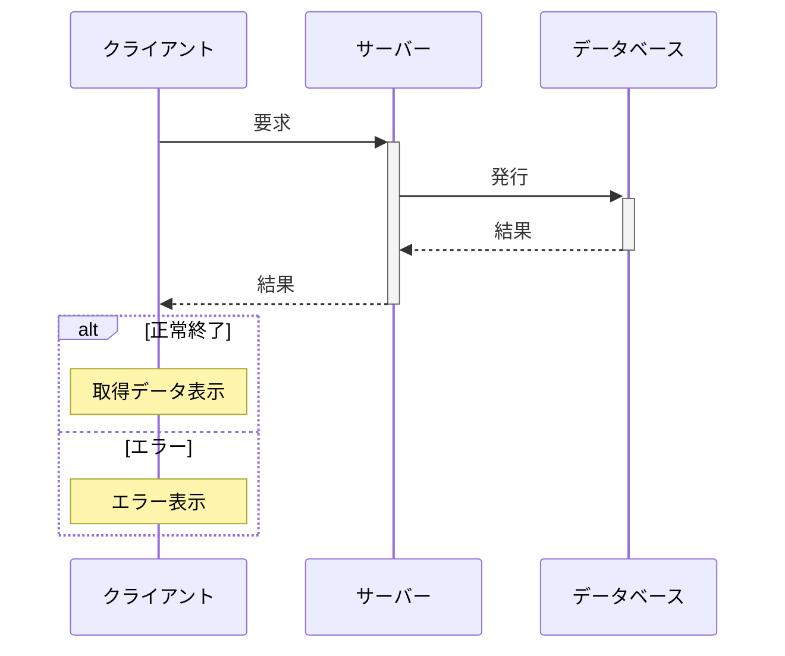

- 実行仕様（イベント）を追加できる。

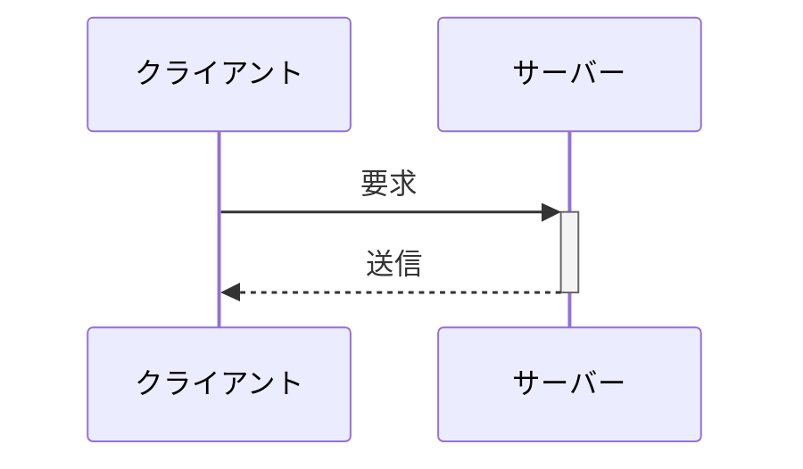

- ノート（メモ）を追加できる。

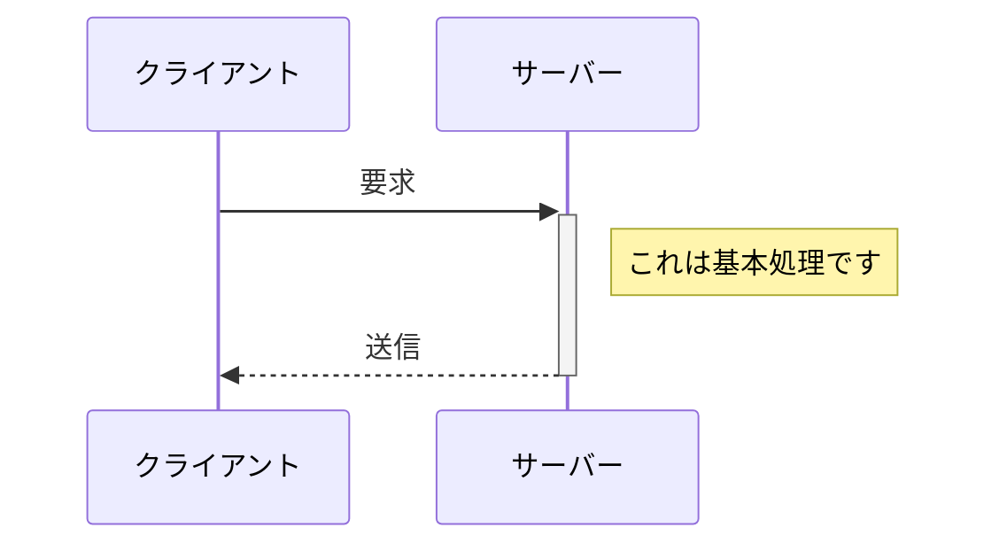

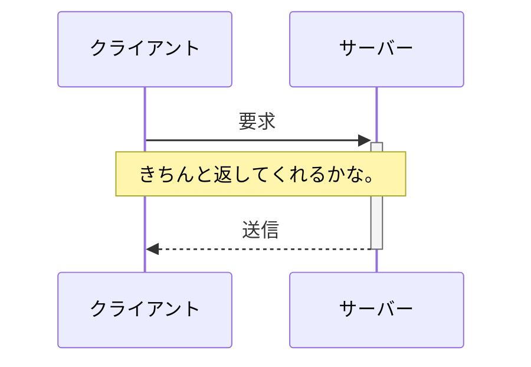

- ループ表現可能

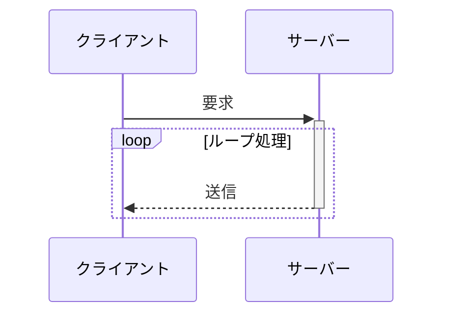

- 条件分岐可能

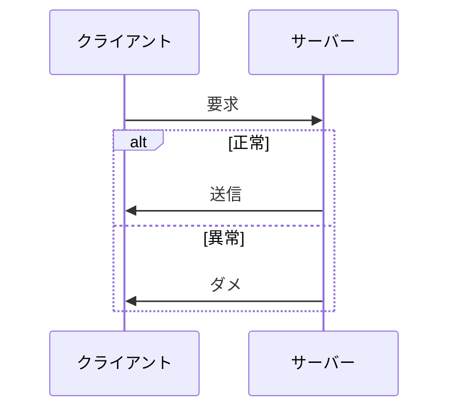

### ガントチャート
- 最初に「gant」を指定する。

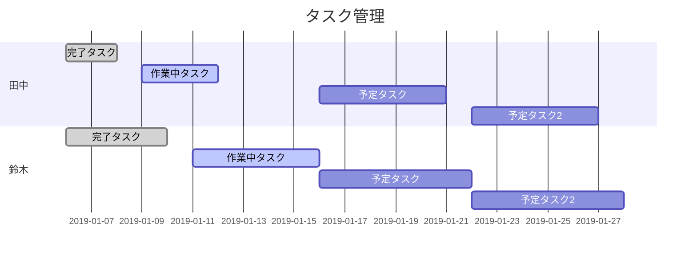