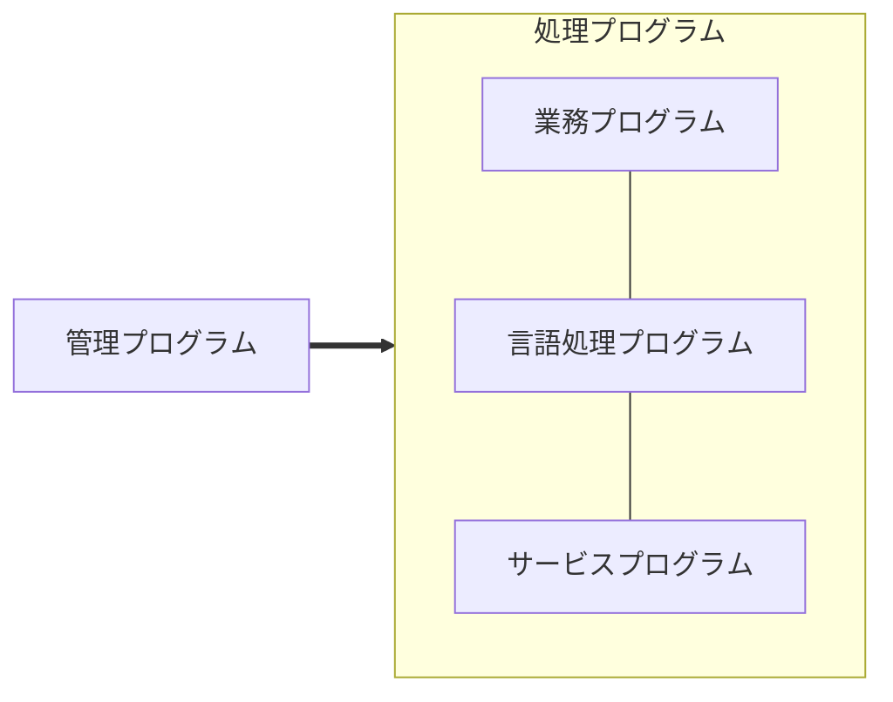

# OS中級

## 定義
- ある目的のために1つ以上の機能要素が相互に関連づけられた全体。
- プログラムの実行を制御するソフトウェア。
    - 資源割振り・スケジューリング・入出力制御・データ管理
    - JIS_情報処理用語でそう定義されている。

- 管理プログラム: 処理プログラムの実行を制御するもの
    - スーパーバイザー
    - そのプログラムを呼び出すことを「スーパーパイザーコール」や「システムコール」と呼ぶ。
- 言語処理プログラム
    - 高級言語で記述されたプログラムを計算機で実行できるようにするもの。
    - 「インタープリンタ」「コンパイラ」型の2つがある。
      - 高級言語(ソースプログラム)を翻訳(オブジェクトプログラム)
      - 参考: https://www.hpcs.cs.tsukuba.ac.jp/~msato/lecture-note/comp-lecture/note1.html

## 参考
- https://www.ny.ics.keio.ac.jp/ipsjts1/2nd-ver/htm/jismain.htm